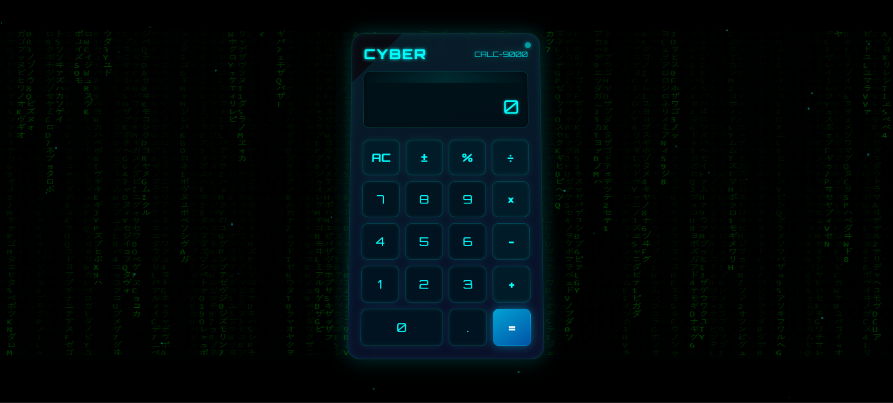

# 🔢 Cyber Calculator - Futuristic Digital Calculator

 

## 🚀 Live Demo
(https://cyber-calculator-digital.netlify.app/)<!-- Add your live demo link here -->

## 🎯 About The Project
The **Cyber Calculator** is a visually stunning, futuristic calculator with a cyberpunk aesthetic. Featuring advanced 3D animations and a responsive design, it provides all standard calculator functions with an immersive user experience.

## ✨ Key Features
- 🌌 Interactive 3D matrix background animation
- 💙 Neon cyberpunk styling with glowing effects
- ⌨️ Full keyboard support alongside touch controls
- 📊 Real-time calculation history display
- 📱 Fully responsive design for all devices
- ⚡ Smooth animations and transitions

## 🛠 Tech Stack
### Core Technologies


### Special Effects


## 📂 Project Structure
cyber-calculator/
├── index.html # Main application file + Css # All styling and animations + Script.js  # Calculator logic and effects
## 🧮 Calculator Functions
- Basic operations (+, -, ×, ÷)
- Percentage calculations
- Sign change (±)
- Decimal point support
- Clear function (AC)
- Keyboard support

## 🔧 Installation
1. Clone the repository:
```bash
git clone https://github.com/harshith1476/cyber-calculator.git
Open index.html in any modern browser

🌟 Usage
Click buttons or use keyboard for calculations

Press 'AC' to clear all

Use '%' for percentage calculations

Press '±' to change sign

🖥️ Browser Support
Browser	Supported
Chrome	✔ Yes
Firefox	✔ Yes
Safari	✔ Yes
Edge	✔ Yes
📜 License
This project is open source and available under the MIT License.

📬 Contact
For any questions or feedback:
📧 Email: vemulaharshith1476@gmail.com
💻 GitHub: harshith1476
